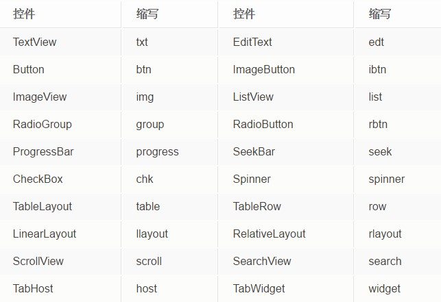

# 代码规范 
## 命名规范   
    Java代码一般使用驼峰式规则，用名词或名词词组命名，每个单词的首字母大写。常用类的命名：  
    activity类，命名以Activity为后缀，如：LoginActivity  
    fragment类，命名以Fragment为后缀，如：ShareDialogFragment  
    service类，命名以Service为后缀，如：DownloadService  
    adapter类，命名以Adapter为后缀，如：CouponListAdapter  
    工具类，命名以Util为后缀，如：EncryptUtil  
    模型类，命名以BO为后缀，如：CouponBO  
    接口实现类，命名以Impl为后缀，如：ApiImpl  
   
## 方法命名  
    初始化方法，命名以init开头，例：initView  
    按钮点击方法，命名以to开头，例：toLogin  
    设置方法，命名以set开头，例：setData   
    具有返回值的获取方法，命名以get开头，例：getData
    通过异步加载数据的方法，命名以load开头，例：loadData
    布尔型的判断方法，命名以is或has，或具有逻辑意义的单词如equals，例：isEmpty  
  
## 控件命名   
控件命名，一般都有各自习惯。但为了保证代码的整洁，尽量保持统一风格  。 
   
  
## 常量命名  
全部为大写单词，单词之间用下划线分开。   
`public final static int PAGE_SIZE = 20; ` 
  
## 变量命名  
{范围描述+}意义描述+类型描述的组合，用驼峰式，首字母小   
    private TextView headerTitleTxt; // 标题栏的标题   
    private Button loginBtn; // 登录按钮  
  
## 控件id命名  
  
控件缩写{范围}意义，范围可选，只在有明确定义的范围内才需要加上。  
    <!-- 这是标题栏的标题 -->  
<TextView 
android:id="@+id/txt_header_title"  
... />  
  
<!-- 这是登录按钮 -->  
<Button  
android:id="@+id/btn_login"  
... />  
  
## layout命名  
组件类型{范围}功能，范围可选，只在有明确定义的范围内才需要加上.  
  
       activity_{范围_}功能，为Activity的命名格式  
       fragment_{范围_}功能，为Fragment的命名格式  
       dialog_{范围_}功能，为Dialog的命名格式   
       item_list_{范围_}功能，为ListView的item命名格式  
       item_grid_{范围_}功能，为GridView的item命名格式  
       header_list_{范围_}功能，为ListView的HeaderView命名格式  
       footer_list_{范围_}功能，为ListView的FooterView命名格式  
## strings的命名  
类型{范围}功能，范围可选。   
以下为几种常用的命名：  
  
    页面标题，命名格式为：title_页面  
    按钮文字，命名格式为：btn_按钮事件  
    标签文字，命名格式为：label_标签文字  
    选项卡文字，命名格式为：tab_选项卡文字  
    消息框文字，命名格式为：toast_消息  
    编辑框的提示文字，命名格式为：hint_提示信息  
    图片的描述文字，命名格式为：desc_图片文字  
    对话框的文字，命名格式为：dialog_文字  
    menu的item文字，命名格式为：action_文字  
  
## colors的命名  
前缀{控件}{范围}{_后缀}，控件、范围、后缀可选，但控件和范围至少要有一个。  
  
    背景颜色，添加bg前缀  
    文本颜色，添加text前缀  
    分割线颜色，添加div前缀  
    区分状态时，默认状态的颜色，添加normal后缀  
    区分状态时，按下时的颜色，添加pressed后缀  
    区分状态时，选中时的颜色，添加selected后缀  
    区分状态时，不可用时的颜色，添加disable后缀  
  
## drawable的命名  
前缀{控件}{范围}{_后缀}，控件、范围、后缀可选，但控件和范围至少要有一个。  
  
    图标类，添加ic前缀  
    背景类，添加bg前缀  
    分隔类，添加div前缀  
    默认类，添加def前缀  
    区分状态时，默认状态，添加normal后缀  
    区分状态时，按下时的状态，添加pressed后缀  
    区分状态时，选中时的状态，添加selected后缀  
    区分状态时，不可用时的状态，添加disable后缀  
    多种状态的，添加selector后缀（一般为ListView的selector或按钮的selector）  

  
## 注释规范  
  

1. 文件头注释  

类和接口注释   
类和接口统一添加javadoc注释，格式如下：  
/**  
 * 类或接口的描述信息  
 *  
 * @author ${USER}  
 * @date ${DATE}  
 */  

1. 方法注释   
下面几种方法，都必须添加javadoc注释，说明该方法的用途和参数说明，以及返回值的说明。  
  
接口中定义的所有方法  
抽象类中自定义的抽象方法    
抽象父类的自定义公用方法  
工具类的公用方法  
    /**  
     * 登录  
     *  
     * @param loginName 登录名  
     * @param password  密码  
     * @param listener  回调监听器  
     */  
    public void login(String loginName, String password, ActionCallbackListener<Void> listener);  
  
1. 变量和常量注释  
下面几种情况下的常量和变量，都要添加注释说明，优先采用右侧//来注释，若注释说明太长则在上方添加注释。  
  
- 接口中定义的所有常量  
- 公有类的公有常量  
- 枚举类定义的所有枚举常量  
- 实体类的所有属性变量  

